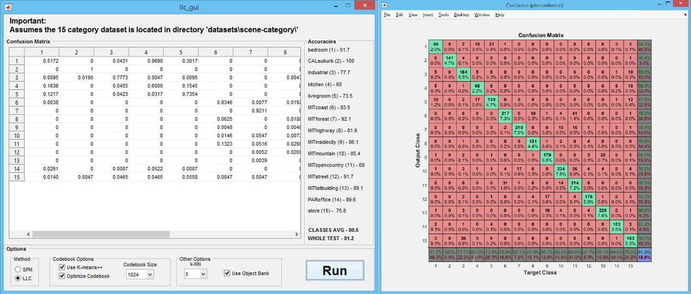
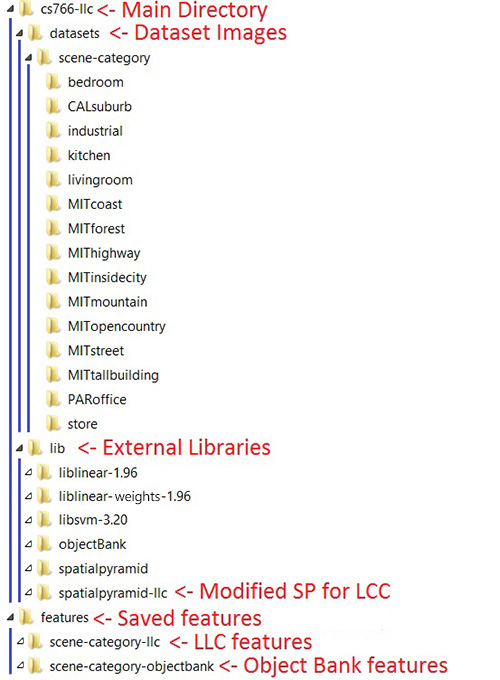

# CS766 Assignment 3 - Locality-constrained Linear Coding for Scene Classification

## Links
* Repository: <https://github.com/cbod/cs766-llc>
* Wiki: <https://github.com/cbod/cs766-llc/wiki>
* Result, credits and usage info can be found in the offline html wiki or in our Github wiki.

## Group Members:
Ke Ma, Christopher Bodden

## Assignment Description:
For this project we implemented Locality-constrained Linear Coding (LLC) image classification method and applied it to a specific dataset of natural scene images. LLC coding improves upon the Vector Quantization (VQ) coding method by preserving a feature's spatial context.

## Features:
This is a brief description of our implementation. More details can be found in the other pages of the wiki.

### Basic Features:
* Modified the basic spatial pyramid to use Locality-constrained Linear Coding (LLC) with max pooling.
* Evaluated LLC against VQ
* Tuned parameters for codebook size and k nearest neighbors to maximize accuracy.

### "Bonus" Features:
* Combined LLC with Object Bank to improve accuracy
* Implemented codebook optimization (algorithm 4.1 in the paper)
* Implemented K-means++ to select K-means initial centers more intelligently
* Implemented Adaboost to improve performance
* Built a GUI to easily run our pipeline

## Program Screenshot:

## Best Result:
Our best results came from **combining LLC and object bank by summing up decision values** (dicussed in results). The classification accuracy with this technique is **81.34%** which is above the state-of-the-art SPM results. The averaged class accuracy for all classes is **80.65%**.

## Important Notes:

### Building External Libraries

We use several outside libraries that need to be built manually for different architectures (x86, x64, etc) and operating systems (MACOS, Windows, Linux). **We guarantee that our code will run for 64-bit MacOS.** The following libraries may need to be built:

1. liblinear-1.96:
    * In "cs766-llc\lib\liblinear-1.96\matlab" run "make.m"

2. liblinear-weights-1.96:
    * In "cs766-llc\lib\liblinear-weights-1.96\matlab" run "make.m"

3. libsvm-3.20:
    * In "cs766-llc\lib\libsvm-3.20\matlab" run "make.m"

4. Object Bank (IMPORTANT: OBJECT BANK WILL NOT RUN ON WINDOWS!):
    * In "cs766-llc\lib\objectBank\partless\code\LSVM" run "compile.m"

### Directory Structure

This project uses many libraries and saves dictionaries/pyramids/object bank data as intermediate files. It is critical that the following directory structure is maintained or the code will not function properly. The most important relationship to preserve is that between the MATLAB scripts and the libraries & dataset.

### Included Codebooks

We have included our codebooks of sizes 512, 1024, and 2048 in order to speed up testing our implementation. These codebooks were generated using all 1500 training images with K-means++ and codebook optimization turned on. The directory for these is:

* "\features\scene-category-llc"

**Any other sizes will have to be created which will take significant time.**

### Features

The saved features are over 5 GB for all of the parameter combinations we tried. To limit the submission size, we have omitted these. They can be regenerated by running our code. **This will take significant time.**

1. LLC features directory:
    * "features\scene-category-llc\<category>"

2. Object Bank features directoy:
    * "features\scene-category-objectbank\<category>"

where <category> is the name of this image category.