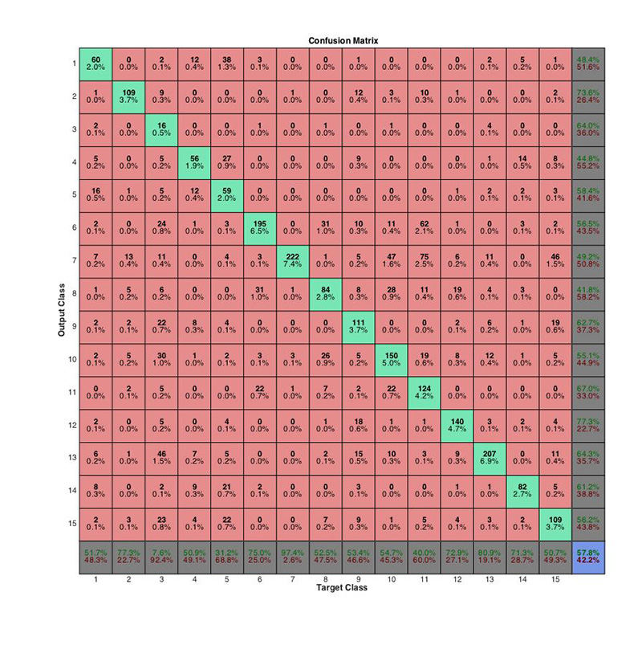
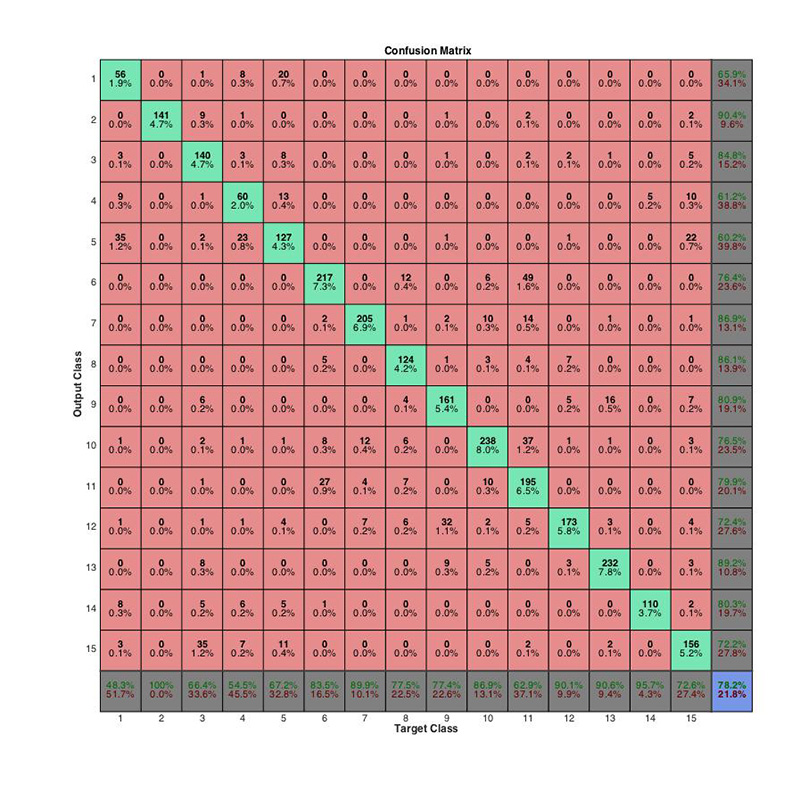
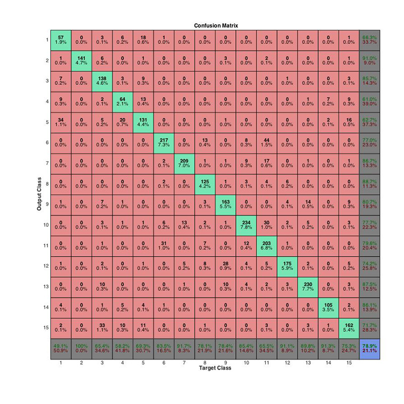

% CS 766 - LLC Project Documentation
% Ke Ma; Christopher Bodden
% 4/20/2015

# LLC Project Overview

## Links
* Repository: <https://github.com/cbod/cs766-llc>
* Wiki: <https://github.com/cbod/cs766-llc/wiki>
* Result, credits and usage info can be found in the offline html wiki or in our Github wiki.

## Group Members:
Ke Ma, Christopher Bodden

## Assignment Description:
For this project we implemented Locality-constrained Linear Coding (LLC) image classification method and applied it to a specific dataset of natural scene images. LLC coding improves upon the Vector Quantization (VQ) coding method by preserving a feature's spatial context.

## Features:
This is a brief description of our implementation. More details can be found in the other pages of the wiki.

### Basic Features:
* Modified the basic spatial pyramid to use Locality-constrained Linear Coding (LLC) with max pooling.
* Evaluated LLC against VQ
* Tuned parameters for codebook size and k nearest neighbors to maximize accuracy.

### "Bonus" Features:
* Combined LLC with Object Bank to improve accuracy
* Implemented codebook optimization (algorithm 4.1 in the paper)
* Implemented K-means++ to select K-means initial centers more intelligently
* Implemented Adaboost to improve performance
* Built a GUI to easily run our pipeline

## Program Screenshot:

## Best Result:
Our best results came from **combining LLC and object bank by summing up decision values** (dicussed in results). The classification accuracy with this technique is **81.34%** which is above the state-of-the-art SPM results. The averaged class accuracy for all classes is **80.65%**.

## Important Notes:

### Building External Libraries

We use several outside libraries that need to be built manually for different architectures (x86, x64, etc) and operating systems (MACOS, Windows, Linux). **We guarantee that our code will run for 64-bit MacOS.** The following libraries may need to be built:

1. liblinear-1.96:
    * In "cs766-llc\\lib\\liblinear-1.96\\matlab" run "make.m"

2. liblinear-weights-1.96:
    * In "cs766-llc\\lib\\liblinear-weights-1.96\\matlab" run "make.m"

3. libsvm-3.20:
    * In "cs766-llc\\lib\\libsvm-3.20\\matlab" run "make.m"

4. Object Bank (IMPORTANT: OBJECT BANK WILL NOT RUN ON WINDOWS!):
    * In "cs766-llc\\lib\\objectBank\\partless\\code\\LSVM" run "compile.m"

### Directory Structure
	
This project uses many libraries and saves dictionaries/pyramids/object bank data as intermediate files. It is critical that the following directory structure is maintained or the code will not function properly. The most important relationship to preserve is that between the MATLAB scripts and the libraries & dataset.

### Included Codebooks

We have included our codebooks of sizes 512, 1024, and 2048 in order to speed up testing our implementation. These codebooks were generated using all 1500 training images with K-means++ and codebook optimization turned on. The directory for these is:

* "\\features\\scene-category-llc"

**Any other sizes will have to be created which will take significant time.**

### Features

The saved features are over 5 GB for all of the parameter combinations we tried. To limit the submission size, we have omitted these. They can be regenerated by running our code. **This will take significant time.**

1. LLC features directory:
    * "features\\scene-category-llc\\<category>"

2. Object Bank features directoy:
    * "features\\scene-category-objectbank\\<category>"

where <category> is the name of this image category.

# Results

We used the same sets of training images and testing images across all settings. To be specific, we designated the first 100 images of each category as the training set, and all the other images as the testing set.

Our best results come from **combining LLC and object bank by summing up decision values**. The classification accuracy is **81.34%**. The average accuracy of all classes is **80.65%**.

## SPM (Baseline)

We ran the baseline experiment with the provided spatial pyramid matching (SPM) code.

The parameters were set according to the SPM paper: SIFT descriptors were computed on 16 x 16 pixel patches over a grid with spacing of 8 pixels; 50 images randomly selected from the training set was used to build the dictionary, whose vocabulary size was 200; histograms were calculated at 3 pyramid levels.

In our experiment environment (Intel Core i7 2.5GHz, 4 cores, 16GB RAM), it took ~0.2s to process each image.

### Using Non-linear SVM with Histogram Intersection Kernel

In order to adopt the histogram intersection kernel, we used LIBSVM instead of LIBLINEAR. We used the default C-SVC for multi-class classification. As the SPM paper didn't report the C parameter they used, we set it to a empirical value of 10.

The training and predicting process took ~60s to run. The classification accuracy is 74.87%. The average accuracy of all classes is 74.08%. The confusion matrix is as follows.

### Using Linear SVM

We also tried to train SVM without histogram intersection kernel. This time we used LIBLINEAR to achieve higher speed. We used the default L2-regularized L2-loss SVC (dual). We used the C parameter of 10.

The training and predicting process took ~1s to run. The classification accuracy is 57.76%. The average accuracy of all classes is 57.83%. The confusion matrix is as follows.

## SPM with "old" SIFT

We noticed that our results were not as good as what the SPM paper reported. Their experiment with the same dataset (although the training set and the testing set were different) and the same parameters (except the parameters for SVM) yielded an accuracy of 81%.

After some investigations, we found that it was due to the "old" SIFT option. After turning on this option, our results were consistent with theirs. It took ~0.45s to process each image. 

It turns out that the SPM code uses different algorithms to compute SIFT descriptor with or without this option. Without this option, the computation is sped up using convolutions, but the quality of the descriptors doesn't seem to be as good. In the following experiments, we always turned on this option.

### Using Non-linear SVM with Histogram Intersection Kernel

We used the default C-SVC. We used the C parameter of 10.

The training and predicting process took ~60s to run. The classification accuracy is 78.96%. The average accuracy of all classes is 77.64%. The confusion matrix is as follows.

### Using Linear SVM

We used the default L2-regularized L2-loss SVC (dual). We used the C parameter of 10.

The training and predicting process took ~1s to run. The classification accuracy is 62.01%. The average accuracy of all classes is 61.48%. The confusion matrix is as follows.

The above results show that SPM doesn't work well without histogram intersection kernel.

## LLC

After replacing VQ coding with locality-constraint linear coding (LLC) in the SPM code, we ran an experiment to test its performance.

We used almost the same set of parameters as the previous experiments, expect that we used a larger codebook of size 1024. For the number of nearest neighbors used for approximated LLC , we set it to 5 according to the LLC paper.

As LLC is more complex than VQ, it was slower to extract features from images. It took ~0.65s to process each image.

We used the default L2-regularized L2-loss SVC (dual). We used the C parameter of 10.

The training and predicting process took ~3s to run. The classification accuracy is 77.96%. The average accuracy of all classes is 76.65%. The confusion matrix is as follows.

This shows that LLC is able to yield comparable results using linear SVM because of its non-linear nature.

## LLC with K-means++

We then sought approaches to further improving the LLC code. The first component we wanted to improve was the K-means clustering used for building the dictionary. As we all know, the result of K-means clustering depends heavily on the initial cluster center assignment. We thus introduced the K-means++ algorithm to choose intelligent initial cluster centers.

The same parameters as the previous experiment were used for this trial.

However, we found K-means++ doesn't contribute much to achieving higher convergence speed or lower overall clustering error. We thought this might be due to the large number of clusters (1024 in this case). Because this modification only affects dictionary building, the execution time for extracting features and training classifiers kept unchanged.

The classification accuracy is 78.22%. The average accuracy of all classes is 77.56%. The confusion matrix is as follows.

This shows that the clustering component may not be the bottleneck, so improving it doesn't affect the accuracy much. Anyway, we kept this K-means++ component in the following experiments.

## LLC with Incremental Codebook Optimization

We also implemented the incremental codebook optimization (algorithm 4.1 in the LLC paper) to improve the performance.

Two important parameters were involved in the algorithm, lambda and sigma. According to the LLC paper, a combination of lamdba equal to 500 and sigma equal to 100 yields good results, but this was not consistent with our results. We found that using this combination of parameters made the cardinality, i.e. the number of significant values in the coding vectors, very small (mostly 1). After careful selection, we chose a combination of lambda equal to 50 and sigma equal to 10, which resulted in the cardinality ranging from 1 to 20, matching the number of neighbors used during classification.

This algorithm goes through every SIFT descriptor in the images that are used for building the dictionary, so it can be very slow. Because this modification only affects dictionary building, the execution time for extracting features and training classifiers kept unchanged.

The classification accuracy is 78.86%. The average accuracy of all classes is 78.15%. The confusion matrix is as follows.

This shows that our codebook optimization works although it takes a long time to run. Since this codebook optimization algorithm doesn't scale with the size of the datasets (but depends on the number of images used for building the dictionary), it can be a worthwhile component to be integrated into the pipeline. 

## Using All Training Images to Build the Dictionary

So far we only used 50 images for building the dictionary, out of 1500 images in the training set. What if we use the whole training set to build the dictionary? Will the dictionary be more representative and yield higher accuracy? Therefore, we ran an experiment to verify this.

Of course, the process of building the dictionary was 30 times slower. Because this modification only affects dictionary building, the execution time for extracting features and training classifiers kept unchanged.

The classification accuracy is 79.20%. The average accuracy of all classes is 78.71%. The confusion matrix is as follows.

This shows that using a larger set of images for building the dictionary does improve the performance to some extent.

## Parameter Selection for LLC

We were also interested how the parameters affect the performance of this algorithm. We wrote a script to automatically run experiments with vocabulary size (M) equal to 512, 1024 and 2048 as well as number of nearest neighbors (K) equal to 1, 2, 5, 10 and 25.

For each combination of parameters, we did a ten-fold cross-validation on the training set. Then we selected the parameters with the highest accuracy, and tested the classification performance on the testing set.

The cross-validation results are given as follows.

| M \\ K |   1   |   2   |   5   |   10  |   25  |
|:-----:|:-----:|:-----:|:-----:|:-----:|:-----:|
|  512  | 81.00 | 83.80 | 81.87 | 79.80 | 77.93 |
|  1024 | 82.60 | 84.67 | 85.33 | 84.33 | 81.87 |
|  2048 | 81.60 | 85.00 | 85.87 | 85.80 | 83.80 |

Therefore, the best combination of parameters should be M = 2048 and K = 5, which was consistent with the results from the LLC paper.

As we used a dictionary with a larger vocabulary size, feature extraction became a bit slower. It took ~0.9s to process each image.

The feature vectors also became longer, so it took more time to train SVMs. The training and predicting process took ~4.5s to run. The classification accuracy is 79.23%. The average accuracy of all classes is 78.37%. The confusion matrix is as follows.

This shows that using a larger vocabulary size doesn't contribute much to the performance improvement. So we continued using the vocabulary size of 1024 in the following experiments.

## Object Bank

Object bank is another state-of-the-art approach to scene classification. We ran an experiment with the object bank code provided by the authors. We used the partless code which can speed up the feature extraction while maintaining even higher classification result.

The provided object bank code is not fully optimized. It took ~3.5s to process each image.

As the extracted feature vectors are not sparse, it usually takes unreasonably long time to train the L2-regularized L2-loss SVC (dual). So we used the L1-regularized logistic regression instead.

The training and predicting process took ~75s to run. The classification accuracy is 79.70%. The average accuracy of all classes is 78.91%. The confusion matrix is as follows.

## Combining LLC and Object Bank

We tried to combine these two state-of-the-art approaches to achieve even higher accuracy. 

### Concatenating Feature Vectors

In our first version, we simply concatenated the two feature vectors from LLC and object bank.

Because the object bank component of the feature vectors was not sparse, we used the L1-regularized logistic regression to speed up training.

The training and predicting process took ~85s to run. The classification accuracy is 79.97%. The average accuracy of all classes is 79.15%. The confusion matrix is as follows.

This shows that concatenating LLC and object bank feature vectors really yields promising results, which outperforms LLC or object bank used separately. However, notice that integrating object bank increases the classification accuracy from 79.20% to 79.97%, but also increases the training and predicting time from ~3s to ~85s. It's a serious question whether this tradeoff is worthwhile or not.

### Summing Up Decision Values

In our second version, we trained two classifiers independently for LLC and object bank, and then summed up decision values to determine the classification of the test images.

The training and predicting process took ~80s to run. The classification accuracy is 81.34%. The average accuracy of all classes is 80.65%. The confusion matrix is as follows.

This shows that summing up decision values from LLC and object bank gives us results that are beyond the state-of-the-art. Although the training and predicting time is still quite long, it achieves really high accuracy in return, which makes us believe that the tradeoff is worthwhile to make.

## Adaboosting

Finally, we tried to use some ensemble learning methods. We chose to implement the famous Adaboost algorithm.

We used the LLC feature vectors only for this experiment. We arbitrarily selected the number of weak learners to be 10, and the C parameter to be 800.

The training and predicting process took ~25s to run. The classification accuracy is 79.50%. The average accuracy of all classes is 78.55%. The confusion matrix is as follows.

This shows that adaboosting doesn't increase the accuracy a lot. We found that this was because the learners were actually strong enough, that is, they almost did a perfect job on classifying the training images (e.g. if we increased the C parameter from 800 to 1000, the "weak" learners would always yield 100% training set accuracy). Given the fixed training set, the learners could not really learn more useful information from it.

# Using the GUI
To make working with our LLC pipeline easier, we've implemented a simple GUI that streamlines the process and visually displays the results. Users can select whether to use SPM or LLC, what codebook size to use, how many nearest neighbors to select, and whether to use k-means++, codebook optimization, and/or object bank.

The GUI basic pipeline is:

1. Run the program (llc_gui.m)
2. Select options (defaults are top performing parameters)
3. Click 'Run'

## Important Notes
For simplicity, some parameters are static for the GUI. These parameters are reflective of the best results discussed in our result section. We also require a certain directory structure.

### Static parameters
1. We use 100 training images per a class
2. We use a grid with spacing of 8 pixels
3. We use 16 x 16 pixel patches
4. We use 3 pyramid levels
5. We set lambda to 50 and sigma to 10
6. The Use Object Bank option uses the summing method of combining LLC and Object Bank

### Directory Structure
As mentioned in the intro, this project uses many libraries and saves dictionaries/pyramids/object bank data as intermediate files. It is critical that the following directory structure is maintained or the code will not function properly. The most important relationship to preserve is that between the MATLAB scripts and the libraries & dataset.

## Starting the GUI
Simply run the file _llc_gui.m_

## Selecting Options

### Method Options

* SPM -> Use basic spatial pyramid (VQ coding)
* LLC -> Use locality-constrained linear coding spatial pyramid (LLC coding)

### Codebook Options

* Use K-means++ -> Check to use K-means++ to seed the K-means algorithm (instead of random initial centers)
* Optimize Codebook -> Check to use the codebook optimization algorithm (algorithm 4.1 in the paper)
* Codebook Size -> Use the dropdown to select the number of codebook features

### Other Options

* k-NN -> Use the dropdown to select the number of nearest neighbors to consider (locality)
* Use Object Bank -> Check to use the combined LLC and Object Bank scene classification

## Interpreting the Results

### Accuracies Panel

This panel contains the accuracy results for each class, the average of these class (CLASSES AVG) results, and the total accuracy (WHOLE TEST) of all test examples considered together.

### Confusion Matrix Panel

This panel contains a table of the raw confusion matrix **(the class number corresponds to the class number in the 'Accuracies Panel')**. A graphical view is also displayed in a separate figure window.

# File Descriptions
For this project we use many existing libraries which have been modified to use LLC coding. Below we describe home-made functions and important library modifications.

## Main Files

### llc_gui.m
`function varargout = llc_gui(varargin)`

This function launches the main GUI window. It is not meant to be called programatically! **Please run this as the main script in MATLAB.**

### lib\\spatialpyramid-llc\\kmeans_plusplus.m
`function [initial_centers] = kmeans_plusplus(data, k)`

Inputs:

* data - N x D matrix of SIFT features for training images
* k - the codebook size (number of centers)

Outputs:

* initial_centers - k x D matrix of initial centers to seed K-means algorithm

### lib\\spatialpyramid-llc\\codebook_opt.m
`function [B] = codebook_opt(Binit, X, lambda, sigma)`

Inputs:

* Binit - M x D initial codebook from k-means
* X - N x D matrix of SIFT features for training images
* lambda - regularization parameter for LLC optimization function
* sigma - distance coefficient parameter

Outputs:

* B - M x D optimized codebook

### lib\\spatialpyramid-llc\\CalculateDictionary.m

Changes:

* Added function calls to use K-means++ and/or codebook optimization (if selected)
* Added new parameters for llc, k-means++, and codebook optimization: 
    - params.sigma - Gaussian coefficient for codebook optimization (a good value is 10)
    - params.lambda - Regularization coefficient for codebook optimization (a good value is 50)
    - params.k - The number of nearest neighbors, locality (a good value is 5);
    - params.useCodebookOptim - {1,0} 1 is true, 0 is false
    - params.useKMeansPP - {1,0} 1 is true, 0 is false;

### lib\\spatialpyramid-llc\\BuildHistograms.m

Changes:

* Changed coding method to use approximate LLC encoding (marked in comments)
* Added new parameters for llc, k-means++, and codebook optimization: 
    * params.sigma - Gaussian coefficient for codebook optimization (a good value is 10)
    * params.lambda - Regularization coefficient for codebook optimization (a good value is 50)
    * params.k - The number of nearest neighbors, locality (a good value is 5);
    * params.useCodebookOptim - {1,0} 1 is true, 0 is false
    * params.useKMeansPP - {1,0} 1 is true, 0 is false;

### lib\\spatialpyramid-llc\\CompilePyramid.m

Changes:

* Changed the pooling to select the max(pyramid patch) value instead of summing (marked in comments)
* Added new parameters for llc, k-means++, and codebook optimization: 
    * params.sigma - Gaussian coefficient for codebook optimization (a good value is 10)
    * params.lambda - Regularization coefficient for codebook optimization (a good value is 50)
    * params.k - The number of nearest neighbors, locality (a good value is 5);
    * params.useCodebookOptim - {1,0} 1 is true, 0 is false
    * params.useKMeansPP - {1,0} 1 is true, 0 is false;

### lib\\spatialpyramid-llc\\BuildPyramid.m

Changes:

* Added new parameters for llc, k-means++, and codebook optimization: 
    * params.sigma - Gaussian coefficient for codebook optimization (a good value is 10)
    * params.lambda - Regularization coefficient for codebook optimization (a good value is 50)
    * params.k - The number of nearest neighbors, locality (a good value is 5);
    * params.useCodebookOptim - {1,0} 1 is true, 0 is false
    * params.useKMeansPP - {1,0} 1 is true, 0 is false;

### lib\\objectBank\\partless\\getfeat_single_image.m

Changes:

* Changed the feature file format to "*.mat".
* Changed the function signature to return the feature vector.
* Added the code for checking and loading existing feature files.

## Individual / Test Scripts
These files are scripts for running various functionality through the pipeline (baseline SPM, LLC, object bank, etc.). Most of their functionality is included in the GUI. These should run if the directory structure is preserved.

### baseline.m

A script to perform 1 test run of the original spatial pyramid code both with and without histograms. Parameters are set with the 'params' structure.

### llc.m

A script to perform 1 test run of the modified LLC spatial pyramid code. Parameters are set with the 'params' structure.

### objectbank.m

A script to perform 1 test run of the object bank code (this is stand alone object bank).

### hybrid.m

A script to perform 1 test run of the combined LLC spatial pyramid & object bank code. 2 versions are tested: 1) using concatenated feature vectors 2) using summed predictors. LLC parameters are set with the 'params' structure.

### adaboost.m

A script to perform 1 test run using an ensemble (adaboost). LLC parameters are set with the 'params' structure.

### llc_test.m

This script tests 10-fold cross validation for parameter values codebook size and k. Values tested are: k_vals = [1 2 5 10 25] & codebook_vals = [512 1024 2048]. Parameters are set with the 'params' structure.

### llc_tune.m
`function [tune_accuracy] = llc_tune(filenames_train, labels_train, image_dir, data_dir, params)`

Inputs:

* filenames_train - a cell array containing the filenames of the training images
* labels_train - the correct labels for the training images
* image_dir - the base directory containing the images
* data_dir - the base directory to store coding data for the training images
* params - the structure containing the spatial pyramid code parameters

Outputs:

* tune_accuracy - the 10-fold cross validation accuracy for this parameter set

Description:

* This function is used to perform 10-fold cross validation for a given set of parameters. This was used to select optimal k & codebook size.

## Other Files
Some other files that are not meant to be used functionally, but are either needed for the GUI or were used for testing.

### _llc_gui.fig_
The MATLAB figure for the main program GUI.

# Credits

Below is a break-down of the work description.

## Ke Ma

* Scene classification pipeline
* Basic LLC bug fix
* Codebook optimization algorithm bug fix
* LLC and object bank combination
* Adaboost algorithm implementation

## Christopher Bodden

* Basic LLC implementation
* K-means++ algorithm implementation
* Codebook optimization algorithm implementation
* Parameter selection for LLC
* GUI

# References

1. Lazebnik, S., Schmid, C., & Ponce, J. (2006). Beyond bags of features: Spatial pyramid matching for recognizing natural scene categories.
2. Wang, J., Yang, J., Yu, K., Lv, F., Huang, T., & Gong, Y. (2010). Locality-constrained linear coding for image classification.
3. Li, L. J., Su, H., Fei-Fei, L., & Xing, E. P. (2010). Object bank: A high-level image representation for scene classification & semantic feature sparsification.
4. Arthur, D., & Vassilvitskii, S. (2007). k-means++: The advantages of careful seeding.
5. Freund, Y., & Schapire, R. E. (1997). A decision-theoretic generalization of on-line learning and an application to boosting.
6. Chang, C. C., & Lin, C. J. (2011). LIBSVM: a library for support vector machines.
7. Fan, R. E., Chang, K. W., Hsieh, C. J., Wang, X. R., & Lin, C. J. (2008). LIBLINEAR: A library for large linear classification.
8. Fifteen Scene Categories. http://www.cs.unc.edu/~lazebnik/research/scene_categories.zip